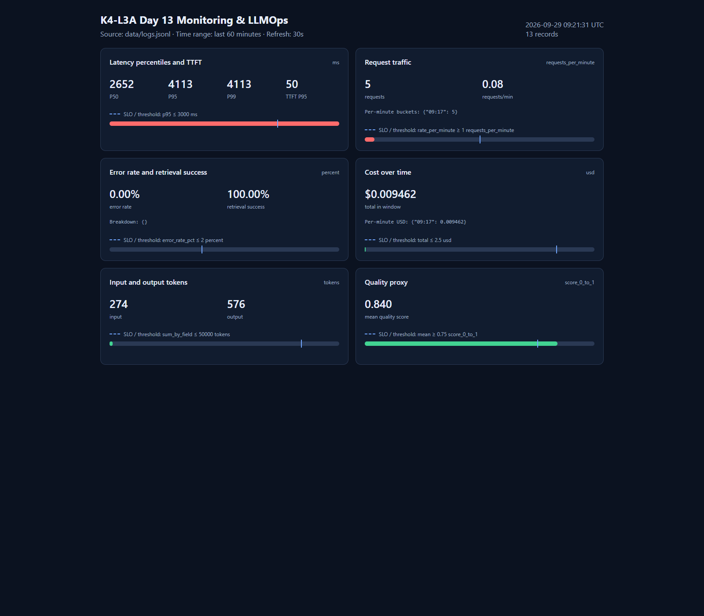

# Báo cáo cá nhân — K4-L3A Day 13 Monitoring & LLMOps

## 1. Thông tin học viên

- **Họ và tên:** Nguyễn Duy Phong
- **MSSV:** 2A202602834
- **Lớp:** K4-L3A
- **Repository URL:** https://github.com/DuyPhong123-ai/K4-L3-DAY13-NguyenDuyPhong-2A202602834-Monitoring-LLMOps
- **Commit SHA nộp:** lấy bằng `git rev-parse HEAD` sau khi tạo commit nộp cuối; commit phải chứa report và toàn bộ evidence bên dưới.
- **Challenge ID:** `day13-k4-l3a-monitoring-llmops-v1`
- **Tên project Langfuse cá nhân:** `day13-k4-l3a-2A202602834`

`config/challenge.json` là file riêng của K4-L3A, đang được `.gitignore` loại trừ và không xuất hiện trong `git ls-files`.

## 2. Evidence index

| Evidence | Đường dẫn |
|---|---|
| Pytest cuối | [01-pytest.txt](evidence/01-pytest.txt) |
| Log validator | [02-log-validator.txt](evidence/02-log-validator.txt) |
| Dashboard validator | [03-dashboard-validator.txt](evidence/03-dashboard-validator.txt) |
| Structured log | [04-structured-log.txt](evidence/04-structured-log.txt) |
| PII redaction | [05-pii-redaction.txt](evidence/05-pii-redaction.txt) |
| Trace list | [06-trace-list.png](evidence/06-trace-list.png) |
| Trace waterfall | [07-trace-waterfall.png](evidence/07-trace-waterfall.png) |
| Trace metadata | [08-trace-metadata.png](evidence/08-trace-metadata.png) |
| Prompt versions | [09-prompt-versions.png](evidence/09-prompt-versions.png) |
| Prompt rollback | [Promote v2](evidence/10a-prompt-promote-v2.png) / [Rollback v1](evidence/10b-prompt-rollback-v1.png) |
| Dashboard runtime | [11-dashboard-overview.png](evidence/11-dashboard-overview.png) |
| Incident metric | [12-incident-metric.png](evidence/12-incident-metric.png) |
| Incident log | [13-incident-log.txt](evidence/13-incident-log.txt) |
| Incident trace | [14-incident-trace.png](evidence/14-incident-trace.png) |

> Evidence 06–10 và 14 được truy vấn từ project Langfuse cá nhân bằng Observations API v2 và không chứa API key/secret. Trước khi nộp, nên chụp thêm UI Langfuse cho 06–10 và 14 để tên project và waterfall hiển thị trực quan theo rubric.

## 3. Kết quả kỹ thuật

| Nội dung | Baseline | Kết quả cuối | Nhận xét |
|---|---:|---:|---|
| `validate_logs.py` | Starter còn TODO, baseline cũ không được giữ lại | **100/100** | 0 missing schema, 0 missing enrichment, 0 PII leak |
| `validate_dashboard.py` | Contract starter có 6 panel | **6/6 panel** | Có thêm dashboard runtime đọc log thật |
| `pytest` | Không ghi nhận trước khi sửa | **26 passed, 0 failed** | Chạy bằng Python trong `.venv` |
| Số traces hợp lệ | Chỉ có root observation | **10/10 trace mới nhất** | Root + retriever + generation đúng quan hệ |
| Số PII leak | Chưa có scrubber trong pipeline | **0** | Kiểm tra độc lập trên log và trace |
| Baseline latency P50/P95/P99 | 152 / 1557 / 1557 ms | Incident: 2652 / 4113 / 4113 ms | P95 incident tăng 2.64 lần |
| TTFT P95 | 52 ms | Incident: 50 ms | TTFT ổn định, không phải nguyên nhân |
| Retrieval success rate | 100% | 100% | Retrieval vẫn thành công nhưng bị chậm |

Baseline latency sử dụng 10 request gần nhất của workload thường (`s01`–`s10`). Incident sử dụng 5 request thuộc session `k4-l3a-challenge-*`.

## 4. Logging và PII

- **Correlation ID:** [middleware](../app/middleware.py) xóa context cũ, nhận `x-request-id` hoặc sinh `req-<8-hex>`, bind vào `structlog`, lưu trong `request.state`, rồi trả lại qua response header.
- **Metadata:** [main.py](../app/main.py) bind `user_id_hash`, `session_id`, `feature`, `model` và `env` trước event `request_received`. `correlation_id` đã được middleware bind trước đó.
- **Structured log:** [logging_config.py](../app/logging_config.py) thêm level/timestamp, chạy scrubber, sau đó mới ghi từng JSON record vào `data/logs.jsonl`.
- **PII:** [pii.py](../app/pii.py) che email, số điện thoại Việt Nam, CCCD và thẻ thanh toán. Scrubber duyệt đệ quy toàn bộ event nên cả payload lồng nhau cũng được xử lý.
- **Kiểm chứng:** [log validator](evidence/02-log-validator.txt) đạt 100/100 và [PII evidence](evidence/05-pii-redaction.txt) cho thấy bốn loại PII đều đã được thay bằng `[REDACTED_*]`.

## 5. Tracing và prompt versioning

- [agent.py](../app/agent.py) tạo cây `lab-agent-run [AGENT]` với hai child cùng cấp: `retrieve-context [RETRIEVER]` và `generate-response [GENERATION]`.
- Trace mang `user_id` đã hash, `session_id`, `feature`, `model`, `environment`, `correlation_id` và chỉ lưu input/output preview đã scrub.
- Generation chứa model, managed prompt, usage input/output/total và cost input/output/total.
- [validate_traces.py](../scripts/validate_traces.py) kiểm tra 10 trace mới nhất bằng Langfuse Observations API v2: **10 valid, 0 invalid, 0 PII leak**.
- Log và trace được nối bằng cùng `correlation_id`; ví dụ `req-54af67e6` tương ứng trace `f5d535ad16ed7610292a76e94957ab54`.

Prompt `day13-chat`:

- **Baseline:** version 1, labels `baseline` và `production`.
- **Candidate:** version 2, label `candidate`; thay đổi nhỏ là giới hạn câu trả lời tối đa ba câu.
- **Cùng input:** baseline trace `082e08366971d29856bd82d1b3b5f0cc`; candidate trace `cdaf77a5dac7c8949d819b0b14e9a6b8`.
- **Promote:** chuyển `production` sang v2 và xác nhận bằng trace `13541d54a9331752e94b8a7d5773a315`.
- **Rollback:** chuyển `production` về v1 và xác nhận bằng trace `342fe2f13b367121d641a5103d3697d3`.
- Workflow có thể chạy lại bằng [prompt_versioning.py](../scripts/prompt_versioning.py).

## 6. Dashboard, SLO và alerts

[Dashboard runtime](../app/dashboard.py) đọc `data/logs.jsonl`, lọc 60 phút gần nhất, tự refresh mỗi 30 giây và hiển thị đúng sáu panel:

1. Latency P50/P95/P99 và TTFT P95.
2. Traffic và request/phút.
3. Error rate, breakdown và retrieval success.
4. Cost theo thời gian và tổng cost.
5. Input/output tokens.
6. Quality proxy trung bình.

Mỗi panel có tên, đơn vị và threshold/SLO marker lấy từ [dashboard.yaml](../config/dashboard.yaml).

SLO trong [slo.yaml](../config/slo.yaml) yêu cầu 99.5% request thành công trong tối đa 3000 ms trên cửa sổ 28 ngày. Error budget là `100% - 99.5% = 0.5%`, tương đương:

- `total_requests × 0.005` bad requests; hoặc
- `28 × 24 × 60 × 0.005 = 201.6 phút`, tức 3 giờ 21 phút 36 giây nếu quy đổi theo thời gian.

[alert_rules.yaml](../config/alert_rules.yaml) và [alerts.md](../docs/alerts.md) định nghĩa ba alert symptom-based:

- `high_user_latency`: P95 > 3000 ms trong 10 phút, critical.
- `elevated_request_error_rate`: error rate > 2% trong 5 phút, critical.
- `low_response_quality`: quality mean < 0.75 trong 15 phút, warning.

Mỗi alert có owner, Slack `#llmops-alerts` và runbook kiểm tra/mitigation.

## 7. Điều tra challenge

- **Challenge ID:** `day13-k4-l3a-monitoring-llmops-v1`
- **Incident:** `rag_slow`
- **Affected feature:** `monitoring`
- **Ngưỡng challenge:** 2000 ms
- **Khoảng điều tra:** `2026-09-29T09:17:12.704807Z` đến `2026-09-29T09:17:28.233702Z`
- **Correlation ID chọn:** `req-54af67e6`
- **Trace ID:** `f5d535ad16ed7610292a76e94957ab54`

### Chuỗi bằng chứng

**Metric → log → trace → span → root cause**

1. Dashboard cho thấy P50/P95/P99 incident là **2652/4113/4113 ms**, trong khi baseline là **152/1557/1557 ms**. P95 tăng từ 1557 lên 4113 ms và vượt SLO 3000 ms.
2. Structured log của `req-54af67e6` ghi `latency_ms=2652`, vượt ngưỡng challenge 2000 ms; TTFT chỉ 50 ms và `tool_success=true`.
3. Trace cùng `correlation_id` có root `lab-agent-run=2.654s`.
4. Child `retrieve-context=2.501s`, chiếm **94.2%** thời gian root; `generate-response=0.151s`.
5. Vì generation và TTFT bình thường còn retrieval chiếm gần toàn bộ thời gian, root cause là độ trễ được inject ở RAG (`rag_slow`), không phải model.

Output client quan sát 12.89–15.55 giây khi concurrency=5, cao hơn latency từng trace. Nguyên nhân bổ sung là `agent.run()` và `time.sleep()` đang chạy đồng bộ bên trong route `async`, làm event loop bị block và các request concurrent phải chờ tuần tự. Trace đo phần thực thi từng agent, còn wall-clock client bao gồm cả thời gian xếp hàng.

### Hành động xử lý

- **Mitigation đã thực hiện:** tắt `rag_slow` sau khi thu evidence; trạng thái incident trở về false.
- **Fix đề xuất:** chuyển retrieval sang async I/O hoặc gọi phần blocking bằng `await asyncio.to_thread(agent.run, ...)`; thêm timeout và cache/fallback cho retrieval.
- **Preventive measure:** theo dõi riêng queue time và retrieval span latency; alert theo P95; chạy load test concurrency trong CI; giữ correlation ID để nối dashboard, log và trace.

## 8. Giải thích và tự đánh giá

- **Quyết định kỹ thuật quan trọng:** scrub PII trước cả file writer và trace export. Điều này bảo đảm dữ liệu nhạy cảm không rời khỏi application boundary rồi mới được xử lý.
- **Blocker đã gặp:** API cũ chiếm port 8000; lần đầu API còn được chạy thiếu `--env-file .env`, khiến Langfuse không nhận key. Sau đó một batch trace cần chờ ingestion trước khi Observations API trả đủ dữ liệu.
- **Cách xử lý:** xác định PID đang listen port 8000, restart API với `--env-file .env`, kiểm tra `/health` có `tracing_enabled=true`, rồi dùng Observations API v2 để audit trace thật.
- **Metrics → Logs → Traces:** metrics khoanh vùng triệu chứng/thời gian; log cung cấp request cụ thể qua `correlation_id`; trace tách thời gian theo từng child observation để xác định root cause.
- **Prompt/token/cost/SLO:** prompt version cho phép so sánh và rollback không cần deploy code; token/cost giúp phát hiện cost spike; SLO và error budget chuyển metric kỹ thuật thành cam kết vận hành có thể cảnh báo.
- **Bài học chính:** chỉ nhìn tổng latency không đủ. Cần child span đúng loại và đúng quan hệ để phân biệt retrieval, prompt fetch, LLM generation và queueing.
- **Hạn chế:** LLM và RAG là mô phỏng; metrics trong `/metrics` nằm trong memory và reset khi restart; dashboard local đọc toàn bộ JSONL; alert mới là contract/runbook, chưa gửi Slack thật. Evidence Langfuse dạng text API nên cần bổ sung screenshot UI cá nhân trước khi nộp để tối đa điểm trình bày.

## 9. Checklist trước khi nộp

- [x] Report dùng đường dẫn evidence tương đối, không có đường dẫn máy cá nhân.
- [x] Starter và challenge ID thuộc K4-L3A; không phát hiện dữ liệu K4-L3B.
- [x] `config/challenge.json` được ignore và không xuất hiện trong `git ls-files`.
- [x] Pytest 26 passed, log validator 100/100, dashboard validator 6/6.
- [x] Có 10 trace IDs hợp lệ, waterfall, metadata, prompt v1/v2 và promote/rollback.
- [x] Dashboard runtime có 6 panel, time range, đơn vị và threshold.
- [x] Có một SLO/error budget và ba alert/runbook.
- [x] Incident evidence nối metric → log/correlation ID → trace → span → root cause.
- [x] Không có secret hoặc PII thô trong report/evidence.
- [ ] Chụp bổ sung UI Langfuse 06–10 và 14 nếu giảng viên yêu cầu ảnh thay vì evidence `.txt` từ API.
- [ ] Tạo commit cuối, điền SHA nộp và push commit lên remote cá nhân trước deadline.
